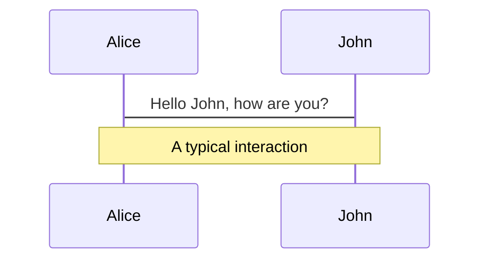
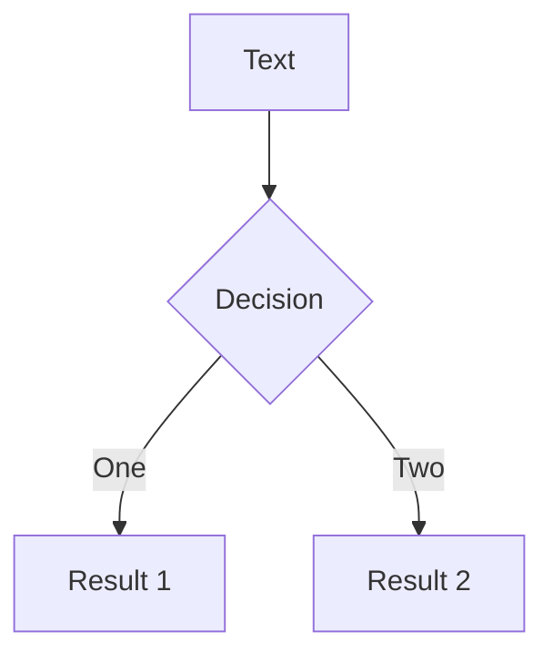
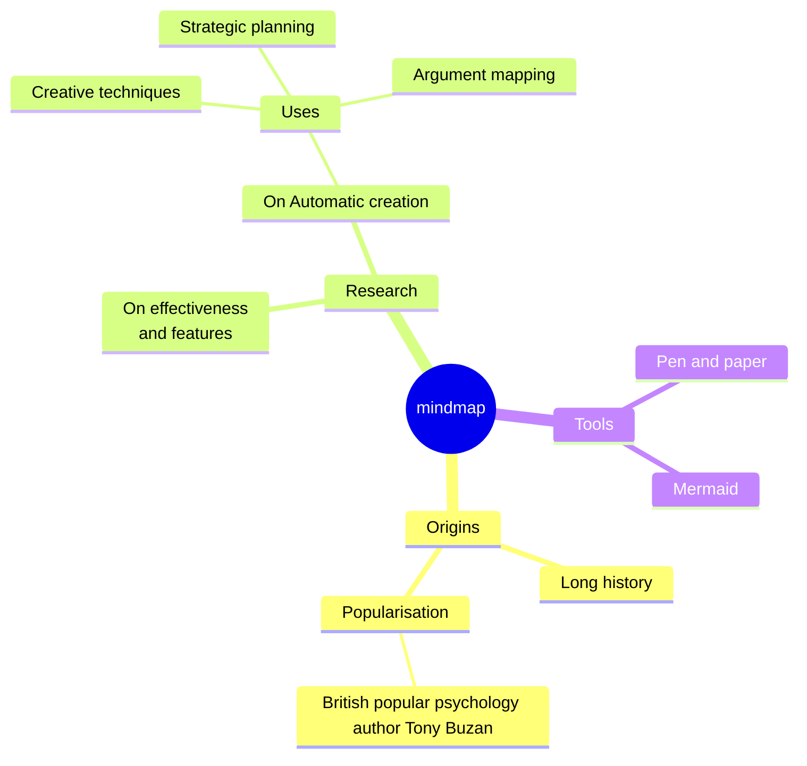
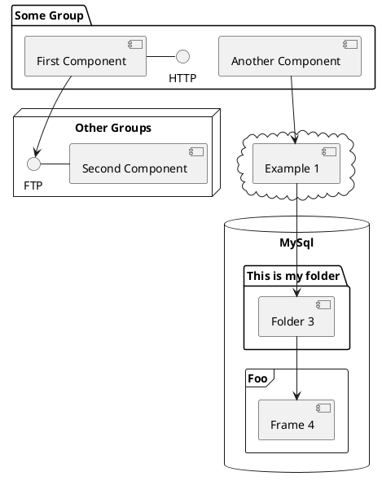

---
# try also 'default' to start simple
highlighter: shiki
# some information about your slides (markdown enabled)
title: 丸3年やってみたけど、Vue Fes Japan運営スタッフはいいぞー！
info: |
  ## Slidev スターターテンプレート
  開発者のためのプレゼンテーションスライド

  詳細は [Sli.dev](https://sli.dev) をご覧ください
# apply UnoCSS classes to the current slide
class: text-center
# https://sli.dev/features/drawing
drawings:
  persist: false
# slide transition: https://sli.dev/guide/animations.html#slide-transitions
transition: fade-out
# enable MDC Syntax: https://sli.dev/features/mdc
mdc: true
# duration of the presentation
duration: 35min
# font settings
fonts:
  sans: 'Kosugi,Hiragino Sans,Hiragino Kaku Gothic ProN,Noto Sans JP,sans-serif'
  serif: 'Hiragino Mincho ProN,Yu Mincho,YuMincho,serif'
  mono: 'Menlo,Monaco,Courier New,monospace'
# custom css
css: unocss
---

---
layout: lm-cover
transition: lm-cover-transition
---

::title::
丸3年やってみたけど、<br>Vue Fes Japan運営スタッフはいいぞー！

::subtitle::
株式会社リンクアンドモチベーション<br>
SRE・イネーブリンググループ

<!--
The last comment block of each slide will be treated as slide notes. It will be visible and editable in Presenter Mode along with the slide. [Read more in the docs](https://sli.dev/guide/syntax.html#notes)
-->

---
layout: lm-profile
transition: slide-up
---

# 自己紹介

<div text-white text-xl space-y-6>

## 鵜木 義秀 (Yoshihide Unoki)

- 株式会社リンクアンドモチベーション
- SRE・イネーブリンググループ
- Vue Fes Japan 運営スタッフ（3年目）

</div>

---
transition: fade-out
---

# Slidevとは？

Slidevは開発者向けに設計されたスライド作成・プレゼンテーションツールで、以下の機能を備えています

- 📝 **テキストベース** - Markdownでコンテンツに集中し、後からスタイルを適用
- 🎨 **テーマ対応** - テーマはnpmパッケージとして共有・再利用可能
- 🧑‍💻 **開発者フレンドリー** - コードハイライト、オートコンプリート付きライブコーディング
- 🤹 **インタラクティブ** - Vueコンポーネントを埋め込んで表現力を向上
- 🎥 **録画機能** - 録画機能とカメラビューを内蔵
- 📤 **ポータブル** - PDF、PPTX、PNG、またはホスティング可能なSPAへエクスポート
- 🛠 **高いカスタマイズ性** - Webページで可能なことはSlidevでも実現可能
  <br>
  <br>

詳細は [Why Slidev?](https://sli.dev/guide/why) をご覧ください

<!--
You can have `style` tag in markdown to override the style for the current page.
Learn more: https://sli.dev/features/slide-scope-style
-->

<style>
h1 {
  background-color: #2B90B6;
  background-image: linear-gradient(45deg, #4EC5D4 10%, #146b8c 20%);
  background-size: 100%;
  -webkit-background-clip: text;
  -moz-background-clip: text;
  -webkit-text-fill-color: transparent;
  -moz-text-fill-color: transparent;
}
</style>

<!--
Here is another comment.
-->

---
transition: slide-up
level: 2
---

# ナビゲーション

左下にマウスを合わせるとナビゲーションのコントロールパネルが表示されます。[詳細](https://sli.dev/guide/ui#navigation-bar)

## キーボードショートカット

|                                                    |                                  |
| -------------------------------------------------- | -------------------------------- |
| <kbd>right</kbd> / <kbd>space</kbd>                | 次のアニメーションまたはスライド |
| <kbd>left</kbd> / <kbd>shift</kbd><kbd>space</kbd> | 前のアニメーションまたはスライド |
| <kbd>up</kbd>                                      | 前のスライド                     |
| <kbd>down</kbd>                                    | 次のスライド                     |

<!-- https://sli.dev/guide/animations.html#click-animation -->


<p v-after class="absolute bottom-23 left-45 opacity-30 transform -rotate-10">ここ！</p>

---
layout: two-cols
layoutClass: gap-16
---

# 目次

`Toc` コンポーネントを使ってスライドの目次を生成できます：

```html
<Toc minDepth="1" maxDepth="1" />
```

タイトルはスライドのコンテンツから推測されますが、フロントマターで `title` と `level` を使って上書きすることもできます。

::right::

<Toc text-sm minDepth="1" maxDepth="2" />

---
layout: image-right
image: https://cover.sli.dev
---

# コード

コードスニペットを使用すると、直接ハイライトが適用され、型のホバー表示も可能です！

```ts [filename-example.ts] {all|4|6|6-7|9|all} twoslash
// TwoSlash enables TypeScript hover information
// and errors in markdown code blocks
// More at https://shiki.style/packages/twoslash
import { computed, ref } from 'vue'

const count = ref(0)
const doubled = computed(() => count.value * 2)

doubled.value = 2
```

<arrow v-click="[4, 5]" x1="350" y1="310" x2="195" y2="342" color="#953" width="2" arrowSize="1" />

<!-- This allow you to embed external code blocks -->

<<< @/snippets/external.ts#snippet

<!-- Footer -->

[詳細](https://sli.dev/features/line-highlighting)

<!-- Inline style -->
<style>
.footnotes-sep {
  @apply mt-5 opacity-10;
}
.footnotes {
  @apply text-sm opacity-75;
}
.footnote-backref {
  display: none;
}
</style>

<!--
Notes can also sync with clicks

[click] This will be highlighted after the first click

[click] Highlighted with `count = ref(0)`

[click:3] Last click (skip two clicks)
-->

---
level: 2
---

# Shiki Magic Move

[shiki-magic-move](https://shiki-magic-move.netlify.app/) を利用して、Slidevは複数のコードスニペット間でアニメーションをサポートしています。

複数のコードブロックを追加し、<code>````md magic-move</code>（4つのバッククォート）で囲むとmagic moveが有効になります。例：

````md magic-move {lines: true}
```ts {*|2|*}
// step 1
const author = reactive({
  name: 'John Doe',
  books: ['Vue 2 - Advanced Guide', 'Vue 3 - Basic Guide', 'Vue 4 - The Mystery'],
})
```

```ts {*|1-2|3-4|3-4,8}
// step 2
export default {
  data() {
    return {
      author: {
        name: 'John Doe',
        books: ['Vue 2 - Advanced Guide', 'Vue 3 - Basic Guide', 'Vue 4 - The Mystery'],
      },
    }
  },
}
```

```ts
// step 3
export default {
  data: () => ({
    author: {
      name: 'John Doe',
      books: ['Vue 2 - Advanced Guide', 'Vue 3 - Basic Guide', 'Vue 4 - The Mystery'],
    },
  }),
}
```

Non-code blocks are ignored.

```vue
<!-- step 4 -->
<script setup>
const author = {
  name: 'John Doe',
  books: ['Vue 2 - Advanced Guide', 'Vue 3 - Basic Guide', 'Vue 4 - The Mystery'],
}
</script>
```
````

---

# コンポーネント

<div grid="~ cols-2 gap-4">
<div>

スライド内でVueコンポーネントを直接使用できます。

`<Tweet/>` や `<Youtube/>` などのビルトインコンポーネントが用意されており、直接使用できます。カスタムコンポーネントの追加も非常に簡単です。

```html
<Counter :count="10" />
```

<!-- ./components/Counter.vue -->
<Counter :count="10" m="t-4" />

詳細は [ガイド](https://sli.dev/builtin/components.html) をご覧ください。

</div>
<div>

```html
<Tweet id="1390115482657726468" />
```

<Tweet id="1390115482657726468" scale="0.65" />

</div>
</div>

<!--
Presenter note with **bold**, *italic*, and ~~striked~~ text.

Also, HTML elements are valid:
<div class="flex w-full">
  <span style="flex-grow: 1;">Left content</span>
  <span>Right content</span>
</div>
-->

---
class: px-20
---

# テーマ

Slidevは強力なテーマサポートを備えています。テーマはスタイル、レイアウト、コンポーネント、さらにはツールの設定も提供できます。フロントマターを**1行編集**するだけでテーマを切り替えられます：

<div grid="~ cols-2 gap-2" m="t-2">

```yaml
---
theme: default
---
```

```yaml
---
theme: seriph
---
```


</div>

[テーマの使い方](https://sli.dev/guide/theme-addon#use-theme) および
[Awesome Themes Gallery](https://sli.dev/resources/theme-gallery) をご覧ください。

---

# クリックアニメーション

要素に `v-click` を追加すると、クリックアニメーションが追加されます。

<div v-click>

スライドをクリックすると表示されます：

```html
<div v-click>This shows up when you click the slide.</div>
```

</div>

<br>

<v-click>

<span v-mark.red="3"><code>v-mark</code> ディレクティブ</span>を使うと、
<span v-mark.circle.orange="4">インラインマーク</span>も追加できます。
[Rough Notation](https://roughnotation.com/) を利用しています：

```html
<span v-mark.underline.orange>inline markers</span>
```

</v-click>

<div mt-20 v-click>

[詳細](https://sli.dev/guide/animations#click-animation)

</div>

---

# モーションアニメーション

モーションアニメーションは [@vueuse/motion](https://motion.vueuse.org/) を利用しており、`v-motion` ディレクティブでトリガーされます。

```html
<div v-motion :initial="{ x: -80 }" :enter="{ x: 0 }" :click-3="{ x: 80 }" :leave="{ x: 1000 }">
  Slidev
</div>
```

<div class="w-60 relative">
  <div class="relative w-40 h-40">
    
    
    
  </div>

  <div
    class="text-5xl absolute top-14 left-40 text-[#2B90B6] -z-1"
    v-motion
    :initial="{ x: -80, opacity: 0}"
    :enter="{ x: 0, opacity: 1, transition: { delay: 2000, duration: 1000 } }">
    Slidev
  </div>
</div>

<!-- vue script setup scripts can be directly used in markdown, and will only affects current page -->
<script setup lang="ts">
const final = {
  x: 0,
  y: 0,
  rotate: 0,
  scale: 1,
  transition: {
    type: 'spring',
    damping: 10,
    stiffness: 20,
    mass: 2
  }
}
</script>

<div
  v-motion
  :initial="{ x:35, y: 30, opacity: 0}"
  :enter="{ y: 0, opacity: 1, transition: { delay: 3500 } }">

[詳細](https://sli.dev/guide/animations.html#motion)

</div>

---

# LaTeX

LaTeXは標準でサポートされています。[KaTeX](https://katex.org/) を利用しています。

<div h-3 />

インライン数式 $\sqrt{3x-1}+(1+x)^2$

ブロック数式

$$
{1|3|all}
\begin{aligned}
\nabla \cdot \vec{E} &= \frac{\rho}{\varepsilon_0} \\
\nabla \cdot \vec{B} &= 0 \\
\nabla \times \vec{E} &= -\frac{\partial\vec{B}}{\partial t} \\
\nabla \times \vec{B} &= \mu_0\vec{J} + \mu_0\varepsilon_0\frac{\partial\vec{E}}{\partial t}
\end{aligned}
$$

[詳細](https://sli.dev/features/latex)

---

# ダイアグラム

Markdown内でテキスト記述から直接、ダイアグラム・グラフを作成できます。

<div class="grid grid-cols-4 gap-5 pt-4 -mb-6">









</div>

詳細：[Mermaid Diagrams](https://sli.dev/features/mermaid) と [PlantUML Diagrams](https://sli.dev/features/plantuml)

---
foo: bar
dragPos:
  square: 691,32,167,_,-16
---

# ドラッグ可能な要素

ドラッグ可能な要素をダブルクリックして位置を編集できます。

<br>

###### ディレクティブの使用

```md

```

<br>

###### コンポーネントの使用

```md
<v-drag text-3xl>
  <div class="i-carbon:arrow-up" />
  Use the `v-drag` component to have a draggable container!
</v-drag>
```

<v-drag pos="663,206,261,_,-15">
  <div text-center text-3xl border border-main rounded>
    ダブルクリックしてください！
  </div>
</v-drag>


###### ドラッグ可能な矢印

```md
<v-drag-arrow two-way />
```

<v-drag-arrow pos="67,452,253,46" two-way op70 />

---
src: ./pages/imported-slides.md
hide: false
---

---

# Monaco Editor

Slidevは Monaco Editor を標準でサポートしています。

コードブロックに `{monaco}` を追加すると、エディターに変換されます：

```ts {monaco}
import { ref } from 'vue'
import { emptyArray } from './external'

const arr = ref(emptyArray(10))
```

`{monaco-run}` を使用すると、スライド内で直接コードを実行できるエディターが作成されます：

```ts {monaco-run}
import { version } from 'vue'
import { emptyArray, sayHello } from './external'

sayHello()
console.log(`vue ${version}`)
console.log(emptyArray<number>(10).reduce((fib) => [...fib, fib.at(-1)! + fib.at(-2)!], [1, 1]))
```

---
layout: center
class: text-center
---

# さらに詳しく

[ドキュメント](https://sli.dev) · [GitHub](https://github.com/slidevjs/slidev) · [ショーケース](https://sli.dev/resources/showcases)

<PoweredBySlidev mt-10 />
